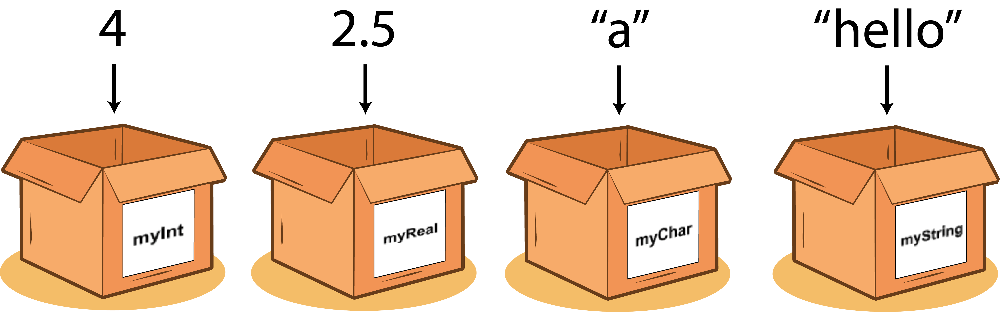

# Road Map Belajar C++
## Memahami  Printing(output) dan Masukan(input)
**Keluaran** & **Masukan** E.g :
```cpp
std::cout << "Hallo World.!"; // untuk output
std:cin >> nama_variabel; // untuk input
```

Contoh Sederhana :
```cpp
#include <iostream>

int main()
{
	int nilai;
	std::cout << "Masukan Nilai : ";
	std::cin >> nilai;
	std::cout << "Nilai yang anda masukan adalah : ";
	std::cout << nilai << std::endl;
}
```

## Memahami Variable, Inisialisasi dan Deklarasi
variabel pada C++ ditandai dengan tipe datanya contoh kita ingin membuat varibel yang dimana ingin menyimpan bilangan bulat kita bisa gunakan tipe data integer, sebagai contoh : <br>

<br>

```cpp
// int ini adalah integer dan nilai merupakan nama variabelnya
int nilai;

// inisialisasi variabel
int nilai = 20;

// deklarasi variabel
int nilai;
```

## Memahami Tipe Data dan bisa Menghitung Nilai Tipe Data Beserta Kegunaanya
Ada beberapa tipe data di bahasa pemrograman C++ diantarannya yaitu :

```cpp
// tipe data bilangan bulat
byte, short, int, dan long

// tipe data bilangan desimal
float, double

// tipe data character, contoh: a, b, c ..
char

// tipe data boolean: true(1) and false(0)
bool
```

masing - masing tipe data diatas memiliki nilai yang berbeda - beda berikut cara melihat nilai dari masing - masing tipe data diatas :

```cpp
#include <iostream>

int main()
{
	// gunakan fungsi sizeof(tipe datanya), E.g:
	int nilai = 20;
	std::cout << "nilai : " << sizeof(nilai) << std::endl;
}
```

## Memahami Bentuk Operator dan cara menggunakanya
Operator adalah simbol yang dapat kita gunakan untuk melakukan suatu operasi misalnya kita ingin menambahkan angak 1 dengan angka 2 tentunya operator yang digunakan adalah simbol `+` jadi `1 + 2` begitu juga dalam bahasa pemrograman, berikut jenis-jenis operator yang wajib kita ketahui :

```cpp
1. Operator Aritmatika ( *, +, -, /, % )
2. Operator Komparasi/perbandingan ( <, >, !=, ==, <=, >= )
3. Operator Logika ( &&, ||, ! )
4. Operator Assignment/penugasan ( +=, -=, /=, *=, ... )
5. Operator Tenary ( ekuivalen dengan if else E.g :  kondisi ? action1 : action2)
6. Operator Bitwise ( librarinya gunakan bitset E.g : &, |, ~, ^, <<, >> )
7. Operator Casting ( merubah jenis tipe data-nya E.g : (tipe datanya) variabelnya)
8. Operator Comma ( simbol (), E.g : (expression1, expression2, expression3, ....) )
```

### Contoh Operator
#### Operator Aritmatika

Berikut contoh operasi dari operator aritmatika :

```cpp
#include <iostream>
using namespace std;

int main()
{

	int a = 6;
	int b = 4;
	int hasil;

	// penjumlahan
	hasil = a + b;
	cout << a << " + " << b << " = " << hasil << endl;

	// pengurangan
	hasil = a - b;
	cout << a << " - " << b << " = " << hasil << endl;

	// perkalian
	hasil = a * b;
	cout << a << " x " << b << " = " << hasil << endl;

	// pembagian
	hasil = a / b;
	cout << a << " / " << b << " = " << hasil << endl;

	// modulus (Sisa bagi)
	hasil = a % b;
	cout << a << " % " << b << " = " << hasil << endl;

	return 0;

}
```

#### Operator Komparasi
Diguanakan untuk membandingkan sebuah nilai, contohnya :

```cpp
#include <iostream>
using namespace std;

int main()
{

	// Komparasi
	int a = 2;
	int b = 3;

	// deklarasi bool
	bool hasil;

	/* Operator perbandingan
	jika nilainya 0 itu false
	jika nilainya 1 itu true */

	// Sebanding
	hasil = (a == b);
	cout << hasil << endl;

	// Tidak sebanding
	hasil = (a != b);
	cout << hasil << endl;

	// Lebih kecil
	hasil = (a < b);
	cout << hasil << endl;

	// Lebih besar
	hasil = (a > b);
	cout << hasil << endl;

	// Lebih kecil atau sebanding
	hasil = (a <= b);
	cout << hasil << endl;

	// Lebih besar atau sebanding
	hasil = (a >= b);
	cout << hasil << endl;
	cout << sizeof(short);

	return 0;

}
```

#### Operator Logika
Sama seperti operator komparasi, tetapi biasanya operator logika digunakan ketika memiliki value yang banyak dan pingin kita bandingkan. contohnya :

```cpp
#include <iostream>
using namespace std;

int main(){
	int a = 3;
	int b = 2;

	// deklarasi
	bool hasil;

	// not atau !
	hasil = !(a == 3);
	cout << hasil << endl;

	// and atau && jika kedua nilai true maka hasilnya true
	cout << "Operator AND \\n";

	hasil = (a == 3) and (b == 2);
	cout << hasil << endl; // true and true

	hasil = (a == 3) and (b == 3);
	cout << hasil << endl; // true and false

	hasil = (a == 2) && (b == 2);
	cout << hasil << endl; // false and true

	hasil = (a == 4) && (b == 4);
	cout << hasil << endl; // false and false

	// or atau || jika kedua nilai false maka hasilnya false
	cout << "Operator OR \\n";

	hasil = (a == 3) or (b == 2);
	cout << hasil << endl; // true or true

	hasil = (a == 3) or (b == 3);
	cout << hasil << endl; // true or false

	hasil = (a == 2) || (b == 2);
	cout << hasil << endl; // false or true

	hasil = (a == 4) || (b == 4);
	cout << hasil << endl; // false or false

	hasil = !((a == 4) and (b == 4));
	cout << hasil << endl;

	return 0;

}
```